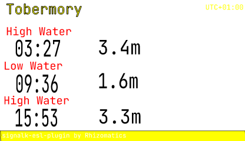

# ESL for SignalK

** ALPHA - not yet fully functioning and very limited vendor/product support **

A SignalK plugin to display data from SignalK paths, APIs and plugins on Electronic Shelf Labels over a Bluetooth Low Energy (BLE) connection.  

Electronic Shelf Labels (ESLs) are [eInk](https://en.wikipedia.org/wiki/E_Ink) devices that consume very little battery energy, presuming they are not constantly updated - the battery is used only when the display changes, and a periodic BLE check for incoming changes. 

Since they are designed to be used in large quantity in small shops, they are cheap and simple devices. Earlier models required dedicated controllers, or updates over Wifi or NFC, whereas many modern ones are standalone BLE devices that can be updated from a phone or server.

Unlike some eInk projects, this plugin doesn't require any physical modification to the labels, or loading any new firmware. It can send an image to a supported shelf label fresh out of the box.

## Examples

## Templating

Templates are simply SVG files, to which expressions can be added to use SignalK data, and optionally use helper functions to make it easier to read. The template can have sample data in the placeholder, so is easy to layout and visualize.

### Template Helpers

- `formatTime`
- `truncate`
- `utcOffset`
- `unitValue`
- `tideLabel`

## CLI

To get fast feedback on templates and shelf devices without updating and configuring SignalK, a CLI is provided that has these commands.

- `vendors` - list supported vendors
- `scan` - report supported devices found from a BLE scan
- `render` - transform an SVG template and data into a PNG
- `paint` - render an SVG template and data to a selected ESL

## Vendors

### Zhsunyco

Also known as 'Suny'

- [BLE ESLs](https://www.zhsunyco.com/digital-display-solution-for-small-retail-business/ble-esl-solution/)
  - The range of labels available on retail sites like Aliexpress may be larger than on their corporate site
  - In mid 2026, a 4 colour (BWRY) 3.7" label retailed for about $35, with quantity discounts for bulk sets
  - Cheapest units are 2 colour 1.54", and they go up to 7.5"

Python code for a variety of their labels at https://github.com/roxburghm/zhsunyco-esl and https://github.com/NickWaterton/Wolink

## Architecture

The primary things managed and provided by the plugin are:

* ESL Vendor
* ESL Device
* SVG Template
* API Provider
  - SignalK built-in or plugin provided, for example signalk-tides
* Template Helper
* Template Context
  - Including metadata generated by this plugin, like repaint timestamp

### Extending

Additional vendors and devices can be added by a separate npm package that implements the `VendorDriver` interface and registers itself - there's no scanning of installed packages, registration is always an explicit call by the extension's own code.

- `import esl from '@rhizomatics/signalk-esl-plugin'; esl.registerVendorDriver(myDriver)`
- In the SignalK runtime, call this from the extension's own plugin `start()`. In the CLI, load the extension with `esl-cli --require <module> <command>`.
- Declare this package as a `peerDependency` (not a regular dependency) in the extension package, so npm resolves a single shared copy of the registry.

Templates can be added to the configurable directory. [Inkscape](https://inkscape.org) free, open source, and recommended for editing templates, or your own favourite editor, or by hand in a text editor for hard core (or just tidying up the template side).